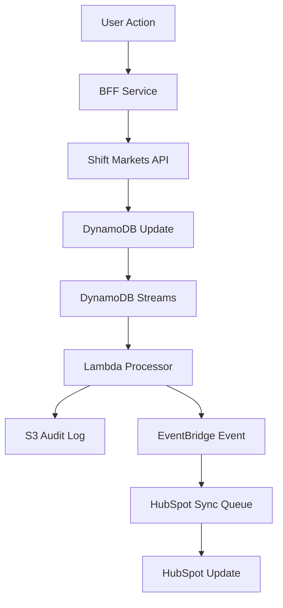

# NA-X Cryptocurrency Exchange - Detailed Infrastructure and Application Design Document

**Version:** 1.0  
**Date:** August 13, 2025  
**Document Owner:** NA-X Technical Architecture Team  

## Table of Contents
1. [Executive Summary](#1-executive-summary)
2. [Architecture Overview](#2-architecture-overview)
3. [Infrastructure Design](#3-infrastructure-design)
4. [Application Architecture](#4-application-architecture)
5. [Security Architecture](#5-security-architecture)
6. [Data Architecture](#6-data-architecture)
7. [Integration Architecture](#7-integration-architecture)
8. [Deployment and DevOps](#8-deployment-and-devops)
9. [Monitoring and Observability](#9-monitoring-and-observability)
10. [Performance and Scalability](#10-performance-and-scalability)
11. [Disaster Recovery and Business Continuity](#11-disaster-recovery-and-business-continuity)
12. [Cost Optimization](#12-cost-optimization)

## 1. Executive Summary

The NA-X cryptocurrency exchange platform leverages a modern, cloud-native architecture built on AWS infrastructure. The design emphasizes security, compliance, scalability, and maintainability while supporting both Australian (Shift Markets) and US (Coinme) market operations.

### 1.1 Key Architectural Decisions

**API Gateway + Private ALB Pattern:** Provides managed API capabilities while keeping application services private, enabling future microservice evolution without infrastructure changes.

**Modular Monolith Approach:** Starts with a single, well-structured service for MVP speed while maintaining clear boundaries for future service extraction based on actual scaling needs.

**DynamoDB + S3 Data Strategy:** Operational state in DynamoDB for performance and scalability, immutable audit trails in S3 for compliance and long-term retention.

**Event-Driven Integration:** SQS and EventBridge enable reliable async processing and future service decoupling without tightly coupled dependencies.

## 2. Architecture Overview

### 2.1 High-Level Architecture Principles

- **Security by Design:** Multi-layered security with defense in depth
- **API-First:** All interactions through well-defined APIs
- **Event-Driven:** Asynchronous processing for scalability and resilience
- **Stateless Services:** Horizontal scalability without session dependencies
- **Infrastructure as Code:** Reproducible, version-controlled infrastructure
- **Observability:** Comprehensive monitoring, logging, and tracing

### 2.2 Service Boundaries and Responsibilities

**Backend for Frontend (BFF):** Single entry point orchestrating all external APIs and business logic  
**External Integrations:** Shift Markets, Coinme, Fireblocks, HubSpot, Payment Providers  
**Data Services:** DynamoDB for operational state, S3 for audit trails  
**Event Processing:** SQS for reliable queuing, EventBridge for event routing  

## 3. Infrastructure Design

### 3.1 AWS Account Structure

```
Production Environment:
├── VPC (10.0.0.0/16)
│   ├── Public Subnets (10.0.1.0/24, 10.0.2.0/24) - Multi-AZ
│   ├── Private Subnets (10.0.10.0/24, 10.0.11.0/24) - Multi-AZ
│   └── Database Subnets (10.0.20.0/24, 10.0.21.0/24) - Multi-AZ
├── Internet Gateway
├── NAT Gateways (Multi-AZ)
└── VPC Endpoints (S3, DynamoDB, ECR, Logs, SSM)
```

**Network Design Rationale:**
- Public subnets only for NAT Gateways and future load balancers
- Private subnets for all application services (ECS tasks)
- Database subnets for potential future RDS instances
- VPC endpoints reduce NAT Gateway traffic and improve security

### 3.2 Compute Infrastructure

#### 3.2.1 ECS Fargate Configuration

```yaml
BFF Service Configuration:
  Task Definition:
    CPU: 1024 (1 vCPU)
    Memory: 2048 MB
    Min Capacity: 2 tasks
    Max Capacity: 20 tasks
    Target CPU Utilization: 70%
    
  Auto Scaling Triggers:
    - CPU Utilization > 70%
    - Memory Utilization > 80%
    - Custom SQS Queue Depth Metric
    - ALB Request Count per Target
```

**Fargate Selection Rationale:**
- No server management overhead
- Built-in multi-AZ deployment
- Automatic scaling without capacity planning
- Pay-per-use pricing model suitable for variable workloads

#### 3.2.2 Load Balancer Architecture

**API Gateway Configuration:**
```yaml
API Gateway Settings:
  Type: REST API (with future WebSocket API support)
  Authentication: Cognito User Pools
  Throttling: 1000 requests/second (burst: 2000)
  Caching: Enabled for read-heavy endpoints (TTL: 5 minutes)
  WAF Integration: Custom rule set for crypto exchange security
  
VPC Link Configuration:
  Type: Network Load Balancer integration
  Target: Private Application Load Balancer
  Health Check: /health endpoint with 10-second interval
```

**Private ALB Configuration:**
```yaml
ALB Settings:
  Scheme: Internal
  IP Address Type: IPv4
  Security Groups: ALB-specific with ECS ingress rules
  Target Groups:
    - BFF Service (HTTP:8080)
    - Health Check: /health (200 response required)
    - Deregistration Delay: 30 seconds for graceful shutdown
```

### 3.3 Data Infrastructure

#### 3.3.1 DynamoDB Design

**Table Structure:**
```yaml
Primary Tables:
  Users:
    Partition Key: user_id (String)
    Attributes: email, kyc_status, created_at, preferences
    GSI: email-index for login lookups
    
  Transactions:
    Partition Key: user_id (String)
    Sort Key: transaction_id (String)
    Attributes: type, amount, status, external_ref, created_at
    GSI: status-index for admin monitoring
    LSI: created_at for user history queries
    
  WebhookReceipts:
    Partition Key: provider (String)
    Sort Key: webhook_id (String)
    Attributes: payload_hash, processed_at, status
    TTL: 30 days for automatic cleanup
    
  SyncCheckpoints:
    Partition Key: service_name (String)
    Sort Key: sync_type (String)
    Attributes: last_sync_timestamp, cursor_position, status
```

**DynamoDB Configuration:**
- On-Demand billing for variable workloads
- Point-in-Time Recovery enabled
- Encryption at rest with KMS customer-managed keys
- DynamoDB Streams for audit trail generation

#### 3.3.2 S3 Audit Store Design

**Bucket Structure:**
```
na-x-audit-store/
├── transaction-logs/
│   └── year=2025/month=08/day=13/hour=14/
│       └── transaction-batch-{timestamp}.json.gz
├── user-activity/
│   └── year=2025/month=08/day=13/
│       └── activity-batch-{timestamp}.json.gz
├── compliance-reports/
│   └── quarterly/2025-Q3/
│       └── austrac-report-{date}.json
└── api-audit-logs/
    └── year=2025/month=08/day=13/hour=14/
        └── api-calls-{timestamp}.json.gz
```

**S3 Configuration:**
- Server-side encryption with KMS
- Versioning enabled with lifecycle policies
- Cross-region replication for disaster recovery
- Glacier transition after 90 days for cost optimization
- Legal hold capability for regulatory requirements

### 3.4 Security Infrastructure

#### 3.4.1 Identity and Access Management

**IAM Role Structure:**
```yaml
ECS Task Roles:
  BFFTaskRole:
    Policies:
      - DynamoDB: Read/Write to application tables
      - S3: Write to audit buckets
      - Secrets Manager: Read application secrets
      - SQS: Send/Receive from application queues
      - EventBridge: Publish events
      
  WebhookProcessorRole:
    Policies:
      - SQS: Receive from webhook queues
      - DynamoDB: Write webhook receipts
      - EventBridge: Publish processed events
      
Service Roles:
  ECSServiceRole:
    Policies:
      - ALB: Register/deregister targets
      - CloudWatch: Publish metrics and logs
```

#### 3.4.2 Network Security

**Security Group Configuration:**
```yaml
ALB Security Group:
  Ingress:
    - Port 443: From VPC Link (HTTPS)
    - Port 80: From VPC Link (redirect to HTTPS)
  Egress:
    - Port 8080: To ECS Security Group
    
ECS Security Group:
  Ingress:
    - Port 8080: From ALB Security Group
  Egress:
    - Port 443: To Internet (for external API calls)
    - Port 5432: To future RDS Security Group
    
RDS Security Group (Future):
  Ingress:
    - Port 5432: From ECS Security Group
  Egress: None
```

**WAF Configuration:**
```yaml
WAF Rules:
  Core Rule Set:
    - AWS Managed Rules: AWSManagedRulesCommonRuleSet
    - Known Bad Inputs: AWSManagedRulesKnownBadInputsRuleSet
    - SQL Injection: AWSManagedRulesSQLiRuleSet
    
  Custom Rules:
    - Rate Limiting: 100 requests per 5 minutes per IP
    - Geographic Blocking: Block traffic from sanctioned countries
    - Bot Detection: Challenge suspicious automation patterns
    - API Abuse Prevention: Block rapid account creation attempts
```

### 3.5 Messaging and Event Infrastructure

#### 3.5.1 SQS Queue Configuration

```yaml
Queue Configurations:
  webhook-processing-queue:
    Visibility Timeout: 30 seconds
    Message Retention: 14 days
    Dead Letter Queue: webhook-dlq (after 3 failures)
    Encryption: KMS with customer-managed key
    
  hubspot-sync-queue:
    Visibility Timeout: 60 seconds
    Message Retention: 14 days
    Dead Letter Queue: hubspot-sync-dlq (after 5 failures)
    Batch Size: 10 messages for efficiency
    
  audit-log-queue:
    Visibility Timeout: 15 seconds
    Message Retention: 7 days
    Dead Letter Queue: audit-dlq (after 2 failures)
    FIFO Queue: true (for ordered processing)
```

#### 3.5.2 EventBridge Configuration

```yaml
Event Bus Configuration:
  Custom Event Bus: na-x-exchange-events
  
Event Rules:
  user-kyc-completed:
    Pattern: {"source": ["shift.kyc"], "detail-type": ["KYC Completed"]}
    Targets: [hubspot-sync-queue, audit-log-queue]
    
  transaction-completed:
    Pattern: {"source": ["na-x.transactions"], "detail-type": ["Transaction Completed"]}
    Targets: [audit-log-queue, compliance-monitoring-queue]
    
  scheduled-reconciliation:
    Schedule: rate(1 hour)
    Target: reconciliation-lambda
```

## 4. Application Architecture

### 4.1 Modular Monolith Design

The BFF service is structured as a modular monolith with clear internal boundaries:

```
src/
├── modules/
│   ├── auth/
│   │   ├── controllers/
│   │   ├── services/
│   │   └── models/
│   ├── shift-adapter/
│   │   ├── client/
│   │   ├── cache/
│   │   └── transformers/
│   ├── payments/
│   │   ├── providers/
│   │   ├── webhooks/
│   │   └── validators/
│   ├── hubspot-sync/
│   │   ├── mapper/
│   │   ├── queue-processor/
│   │   └── api-client/
│   └── audit/
│       ├── logger/
│       ├── s3-writer/
│       └── compliance/
├── shared/
│   ├── middleware/
│   ├── utils/
│   └── types/
└── infrastructure/
    ├── database/
    ├── messaging/
    └── monitoring/
```

### 4.2 API Design Patterns

#### 4.2.1 RESTful API Structure

```yaml
API Endpoints:
  Authentication:
    POST /auth/register
    POST /auth/login
    POST /auth/refresh
    POST /auth/logout
    
  User Management:
    GET /users/profile
    PUT /users/profile
    GET /users/kyc-status
    POST /users/kyc-documents
    
  Trading:
    GET /markets/{pair}/orderbook
    POST /orders
    GET /orders
    DELETE /orders/{id}
    GET /trades/history
    
  Wallets:
    GET /wallets/balances
    POST /wallets/deposit-address
    POST /wallets/withdraw
    GET /wallets/transactions
    
  Fiat Operations:
    POST /fiat/deposit
    POST /fiat/withdraw
    GET /fiat/transactions
```

#### 4.2.2 GraphQL Integration (Shift Markets)

```typescript
// Shift Markets GraphQL Client Configuration
const shiftClient = new ApolloClient({
  uri: process.env.SHIFT_GRAPHQL_ENDPOINT,
  headers: {
    'Authorization': `Bearer ${shiftApiKey}`,
    'Content-Type': 'application/json'
  },
  defaultOptions: {
    query: {
      errorPolicy: 'all',
      fetchPolicy: 'cache-first'
    },
    mutate: {
      errorPolicy: 'all'
    }
  },
  cache: new InMemoryCache({
    typePolicies: {
      User: {
        keyFields: ['userId']
      },
      Order: {
        keyFields: ['orderId']
      }
    }
  })
});

// Example Query Implementation
const getUserBalances = async (userId: string) => {
  const { data, errors } = await shiftClient.query({
    query: GET_USER_BALANCES,
    variables: { userId },
    context: {
      headers: {
        'X-User-ID': userId
      }
    }
  });
  
  if (errors) {
    logger.error('Shift API Error', { errors, userId });
    throw new ShiftAPIError(errors);
  }
  
  return data.user.balances;
};
```

### 4.3 Caching Strategy

#### 4.3.1 ElastiCache Implementation

```yaml
Cache Configuration:
  Engine: Redis 7.0
  Node Type: cache.r7g.large
  Cluster Mode: Enabled (3 shards, 1 replica each)
  Encryption: In-transit and at-rest enabled
  
Cache Patterns:
  Market Data:
    TTL: 5 seconds
    Key Pattern: "market:{pair}:orderbook"
    Invalidation: WebSocket updates
    
  User Sessions:
    TTL: 15 minutes (refresh token: 7 days)
    Key Pattern: "session:{userId}:{tokenId}"
    Invalidation: Logout or security events
    
  Rate Limiting:
    TTL: 60 seconds
    Key Pattern: "rate_limit:{userId}:{endpoint}"
    Usage: API throttling and DDoS protection
```

#### 4.3.2 Application-Level Caching

```typescript
// Redis Cache Service Implementation
class CacheService {
  private redis: Redis;
  
  async getMarketData(pair: string): Promise<OrderBook | null> {
    const cached = await this.redis.get(`market:${pair}:orderbook`);
    if (cached) {
      return JSON.parse(cached);
    }
    
    // Fetch from Shift Markets API
    const orderBook = await this.shiftAdapter.getOrderBook(pair);
    
    // Cache with short TTL for real-time data
    await this.redis.setex(
      `market:${pair}:orderbook`, 
      5, 
      JSON.stringify(orderBook)
    );
    
    return orderBook;
  }
  
  async invalidateUserCache(userId: string): Promise<void> {
    const pattern = `user:${userId}:*`;
    const keys = await this.redis.keys(pattern);
    if (keys.length > 0) {
      await this.redis.del(...keys);
    }
  }
}
```

### 4.4 Error Handling and Resilience

#### 4.4.1 Circuit Breaker Pattern

```typescript
// Circuit Breaker Implementation for External APIs
class CircuitBreaker {
  private failures: number = 0;
  private nextAttempt: number = Date.now();
  private state: 'CLOSED' | 'OPEN' | 'HALF_OPEN' = 'CLOSED';
  
  async execute<T>(operation: () => Promise<T>): Promise<T> {
    if (this.state === 'OPEN') {
      if (Date.now() < this.nextAttempt) {
        throw new Error('Circuit breaker is OPEN');
      }
      this.state = 'HALF_OPEN';
    }
    
    try {
      const result = await operation();
      this.onSuccess();
      return result;
    } catch (error) {
      this.onFailure();
      throw error;
    }
  }
  
  private onSuccess(): void {
    this.failures = 0;
    this.state = 'CLOSED';
  }
  
  private onFailure(): void {
    this.failures++;
    if (this.failures >= 5) {
      this.state = 'OPEN';
      this.nextAttempt = Date.now() + (30 * 1000); // 30 seconds
    }
  }
}

// Usage in Shift Markets Adapter
class ShiftMarketsAdapter {
  private circuitBreaker = new CircuitBreaker();
  
  async placeOrder(orderRequest: OrderRequest): Promise<Order> {
    return this.circuitBreaker.execute(async () => {
      const response = await this.httpClient.post('/orders', orderRequest);
      return response.data;
    });
  }
}
```

#### 4.4.2 Retry Logic with Exponential Backoff

```typescript
// Retry decorator for external service calls
function retryWithBackoff(maxRetries: number = 3, baseDelay: number = 1000) {
  return function(target: any, propertyName: string, descriptor: PropertyDescriptor) {
    const originalMethod = descriptor.value;
    
    descriptor.value = async function(...args: any[]) {
      let lastError: Error;
      
      for (let attempt = 0; attempt <= maxRetries; attempt++) {
        try {
          return await originalMethod.apply(this, args);
        } catch (error) {
          lastError = error;
          
          if (attempt === maxRetries) {
            throw error;
          }
          
          const delay = baseDelay * Math.pow(2, attempt);
          await new Promise(resolve => setTimeout(resolve, delay));
        }
      }
      
      throw lastError;
    };
  };
}

// Usage example
class PaymentService {
  @retryWithBackoff(3, 1000)
  async processPayment(payment: Payment): Promise<PaymentResult> {
    return await this.stripeClient.charges.create(payment);
  }
}
```

## 5. Security Architecture

### 5.1 Authentication and Authorization

#### 5.1.1 Cognito User Pool Configuration

```yaml
Cognito Configuration:
  User Pool:
    Password Policy:
      MinimumLength: 12
      RequireUppercase: true
      RequireLowercase: true
      RequireNumbers: true
      RequireSymbols: true
      
    MFA Configuration:
      MfaConfiguration: OPTIONAL
      SmsConfiguration:
        ExternalId: na-x-mfa-external-id
        SnsCallerArn: arn:aws:iam::account:role/SNSRole
        
    AccountRecoveryConfiguration:
      RecoveryMechanisms:
        - Name: verified_email
          Priority: 1
        - Name: verified_phone_number
          Priority: 2
          
  App Clients:
    WebAppClient:
      GenerateSecret: false
      RefreshTokenValidity: 7 days
      AccessTokenValidity: 15 minutes
      IdTokenValidity: 15 minutes
      
    MobileAppClient:
      GenerateSecret: false
      RefreshTokenValidity: 30 days
      AccessTokenValidity: 1 hour
```

#### 5.1.2 JWT Token Validation

```typescript
// JWT middleware for Express.js
import jwt from 'jsonwebtoken';
import jwksClient from 'jwks-rsa';

class AuthMiddleware {
  private jwksClient;
  
  constructor() {
    this.jwksClient = jwksClient({
      jwksUri: `https://cognito-idp.${region}.amazonaws.com/${userPoolId}/.well-known/jwks.json`,
      cache: true,
      cacheMaxAge: 600000, // 10 minutes
      rateLimit: true,
      jwksRequestsPerMinute: 10
    });
  }
  
  async validateToken(token: string): Promise<any> {
    const decoded = jwt.decode(token, { complete: true });
    if (!decoded || !decoded.header.kid) {
      throw new Error('Invalid token');
    }
    
    const key = await this.getSigningKey(decoded.header.kid);
    const verified = jwt.verify(token, key, {
      algorithms: ['RS256'],
      issuer: `https://cognito-idp.${region}.amazonaws.com/${userPoolId}`,
      audience: clientId
    });
    
    return verified;
  }
  
  private async getSigningKey(kid: string): Promise<string> {
    return new Promise((resolve, reject) => {
      this.jwksClient.getSigningKey(kid, (err, key) => {
        if (err) reject(err);
        else resolve(key.getPublicKey());
      });
    });
  }
}
```

### 5.2 Data Encryption

#### 5.2.1 Encryption at Rest

```yaml
KMS Configuration:
  Customer Managed Keys:
    ApplicationDataKey:
      Description: "Key for application data encryption"
      KeyUsage: ENCRYPT_DECRYPT
      KeySpec: SYMMETRIC_DEFAULT
      KeyPolicy:
        - Principal: ECS Task Role
          Actions: [kms:Decrypt, kms:GenerateDataKey]
        - Principal: Admin Role
          Actions: [kms:*]
          
    AuditLogKey:
      Description: "Key for audit log encryption"
      KeyUsage: ENCRYPT_DECRYPT
      KeySpec: SYMMETRIC_DEFAULT
      DeletionWindowInDays: 30
      
Service Encryption:
  DynamoDB:
    SSESpecification:
      SSEEnabled: true
      KMSMasterKeyId: alias/na-x-application-data
      
  S3:
    BucketEncryption:
      Rules:
        - ApplyServerSideEncryptionByDefault:
            SSEAlgorithm: aws:kms
            KMSMasterKeyID: alias/na-x-audit-logs
          BucketKeyEnabled: true
          
  ECS:
    LogConfiguration:
      LogDriver: awslogs
      Options:
        awslogs-group: /na-x/application
        awslogs-region: us-east-1
        awslogs-stream-prefix: ecs
        awslogs-encryption: true
```

#### 5.2.2 Encryption in Transit

```typescript
// HTTPS Client Configuration
import https from 'https';
import axios from 'axios';

const httpsAgent = new https.Agent({
  rejectUnauthorized: true,
  secureProtocol: 'TLSv1_2_method',
  ciphers: [
    'ECDHE-RSA-AES256-GCM-SHA384',
    'ECDHE-RSA-AES128-GCM-SHA256',
    'ECDHE-RSA-AES256-SHA384',
    'ECDHE-RSA-AES128-SHA256'
  ].join(':')
});

const secureApiClient = axios.create({
  httpsAgent,
  timeout: 30000,
  headers: {
    'Strict-Transport-Security': 'max-age=31536000; includeSubDomains',
    'X-Content-Type-Options': 'nosniff',
    'X-Frame-Options': 'DENY',
    'X-XSS-Protection': '1; mode=block'
  }
});
```

### 5.3 Secrets Management

#### 5.3.1 AWS Secrets Manager Integration

```typescript
// Secrets Manager Service
import { SecretsManagerClient, GetSecretValueCommand } from '@aws-sdk/client-secrets-manager';

class SecretsService {
  private client: SecretsManagerClient;
  private cache: Map<string, { value: any; expiry: number }> = new Map();
  
  constructor() {
    this.client = new SecretsManagerClient({ region: process.env.AWS_REGION });
  }
  
  async getSecret(secretId: string): Promise<any> {
    // Check cache first
    const cached = this.cache.get(secretId);
    if (cached && cached.expiry > Date.now()) {
      return cached.value;
    }
    
    try {
      const command = new GetSecretValueCommand({ SecretId: secretId });
      const response = await this.client.send(command);
      
      const secretValue = JSON.parse(response.SecretString || '{}');
      
      // Cache for 5 minutes
      this.cache.set(secretId, {
        value: secretValue,
        expiry: Date.now() + (5 * 60 * 1000)
      });
      
      return secretValue;
    } catch (error) {
      logger.error('Failed to retrieve secret', { secretId, error });
      throw new Error('Secret retrieval failed');
    }
  }
}

// Usage in application
const secrets = new SecretsService();

const shiftApiCredentials = await secrets.getSecret('na-x/shift-markets/api-credentials');
const fireblocksConfig = await secrets.getSecret('na-x/fireblocks/config');
```

## 6. Data Architecture

### 6.1 Data Flow and Processing

#### 6.1.1 Real-time Data Pipeline



#### 6.1.2 Batch Processing Pipeline

```typescript
// Reconciliation Service for Daily Processing
class ReconciliationService {
  async performDailyReconciliation(): Promise<ReconciliationReport> {
    const report: ReconciliationReport = {
      date: new Date().toISOString().split('T')[0],
      discrepancies: [],
      summary: {
        totalTransactions: 0,
        totalVolume: 0,
        reconciliationStatus: 'IN_PROGRESS'
      }
    };
    
    try {
      // Fetch transaction data from multiple sources
      const [naXTransactions, shiftTransactions, fireblocksTransactions] = 
        await Promise.all([
          this.getNAXTransactions(),
          this.getShiftTransactions(),
          this.getFireblocksTransactions()
        ]);
      
      // Perform reconciliation logic
      const discrepancies = this.findDiscrepancies(
        naXTransactions,
        shiftTransactions,
        fireblocksTransactions
      );
      
      report.discrepancies = discrepancies;
      report.summary.reconciliationStatus = 
        discrepancies.length === 0 ? 'RECONCILED' : 'DISCREPANCIES_FOUND';
      
      // Store reconciliation report
      await this.storeReconciliationReport(report);
      
      // Alert if discrepancies found
      if (discrepancies.length > 0) {
        await this.alertOnDiscrepancies(discrepancies);
      }
      
      return report;
    } catch (error) {
      logger.error('Reconciliation failed', { error });
      report.summary.reconciliationStatus = 'FAILED';
      throw error;
    }
  }
}
```

### 6.2 Data Retention and Archival

#### 6.2.1 S3 Lifecycle Policies

```yaml
S3 Lifecycle Configuration:
  Rules:
    - Id: "audit-log-lifecycle"
      Status: Enabled
      Filter:
        Prefix: "audit-logs/"
      Transitions:
        - Days: 30
          StorageClass: STANDARD_IA
        - Days: 90
          StorageClass: GLACIER
        - Days: 2555  # 7 years
          StorageClass: DEEP_ARCHIVE
      Expiration:
        Days: 3650  # 10 years for compliance
        
    - Id: "transaction-logs-lifecycle"
      Status: Enabled
      Filter:
        Prefix: "transaction-logs/"
      Transitions:
        - Days: 1
          StorageClass: STANDARD_IA
        - Days: 30
          StorageClass: GLACIER
        - Days: 365
          StorageClass: DEEP_ARCHIVE
      NoncurrentVersionTransitions:
        - NoncurrentDays: 30
          StorageClass: GLACIER
```

#### 6.2.2 DynamoDB Point-in-Time Recovery

```typescript
// DynamoDB Backup and Recovery Service
class DynamoDBBackupService {
  private dynamodb: DynamoDBClient;
  
  async createBackup(tableName: string): Promise<string> {
    const command = new CreateBackupCommand({
      TableName: tableName,
      BackupName: `${tableName}-backup-${Date.now()}`
    });
    
    const response = await this.dynamodb.send(command);
    return response.BackupDetails?.BackupArn || '';
  }
  
  async enablePointInTimeRecovery(tableName: string): Promise<void> {
    const command = new UpdateContinuousBackupsCommand({
      TableName: tableName,
      PointInTimeRecoverySpecification: {
        PointInTimeRecoveryEnabled: true
      }
    });
    
    await this.dynamodb.send(command);
  }
  
  async restoreFromPointInTime(
    sourceTableName: string,
    targetTableName: string,
    restoreDateTime: Date
  ): Promise<void> {
    const command = new RestoreTableFromBackupCommand({
      TargetTableName: targetTableName,
      SourceTableName: sourceTableName,
      RestoreDateTime: restoreDateTime
    });
    
    await this.dynamodb.send(command);
  }
}
```

## 7. Integration Architecture

### 7.1 External Service Integration Patterns

#### 7.1.1 Shift Markets GraphQL Integration

```typescript
// Shift Markets Client with Error Handling and Retry Logic
class ShiftMarketsClient {
  private client: ApolloClient<any>;
  private circuitBreaker: CircuitBreaker;
  
  constructor() {
    this.client = new ApolloClient({
      uri: process.env.SHIFT_GRAPHQL_ENDPOINT,
      link: createHttpLink({
        uri: process.env.SHIFT_GRAPHQL_ENDPOINT,
        headers: {
          authorization: `Bearer ${process.env.SHIFT_API_TOKEN}`
        }
      }),
      cache: new InMemoryCache(),
      defaultOptions: {
        watchQuery: {
          errorPolicy: 'all'
        }
      }
    });
    
    this.circuitBreaker = new CircuitBreaker({
      timeout: 30000,
      errorThresholdPercentage: 50,
      resetTimeout: 30000
    });
  }
  
  async executeQuery<T>(query: DocumentNode, variables?: any): Promise<T> {
    return this.circuitBreaker.fire(async () => {
      const result = await this.client.query({
        query,
        variables,
        fetchPolicy: 'network-only'
      });
      
      if (result.errors) {
        throw new ShiftAPIError(result.errors);
      }
      
      return result.data;
    });
  }
  
  async executeMutation<T>(mutation: DocumentNode, variables?: any): Promise<T> {
    return this.circuitBreaker.fire(async () => {
      const result = await this.client.mutate({
        mutation,
        variables
      });
      
      if (result.errors) {
        throw new ShiftAPIError(result.errors);
      }
      
      return result.data;
    });
  }
}

// Example GraphQL Operations
const CREATE_ORDER = gql`
  mutation CreateOrder($input: CreateOrderInput!) {
    createOrder(input: $input) {
      id
      status
      price
      quantity
      side
      createdAt
    }
  }
`;

const GET_USER_BALANCES = gql`
  query GetUserBalances($userId: ID!) {
    user(id: $userId) {
      balances {
        asset
        available
        locked
        total
      }
    }
  }
`;
```

#### 7.1.2 Webhook Processing Architecture

```typescript
// Webhook Processing Service
class WebhookProcessor {
  private processors: Map<string, WebhookHandler> = new Map();
  
  constructor() {
    // Register webhook handlers
    this.processors.set('stripe', new StripeWebhookHandler());
    this.processors.set('bcb', new BCBWebhookHandler());
    this.processors.set('banxa', new BanxaWebhookHandler());
    this.processors.set('fireblocks', new FireblocksWebhookHandler());
  }
  
  async processWebhook(
    provider: string,
    payload: any,
    signature: string
  ): Promise<WebhookResult> {
    const processor = this.processors.get(provider);
    if (!processor) {
      throw new Error(`Unknown webhook provider: ${provider}`);
    }
    
    // Verify webhook signature
    const isValid = await processor.verifySignature(payload, signature);
    if (!isValid) {
      throw new Error('Invalid webhook signature');
    }
    
    // Check for duplicate processing
    const webhookId = processor.extractWebhookId(payload);
    const isDuplicate = await this.checkDuplicate(provider, webhookId);
    if (isDuplicate) {
      return { status: 'DUPLICATE', webhookId };
    }
    
    // Process the webhook
    const result = await processor.process(payload);
    
    // Record successful processing
    await this.recordWebhookReceipt(provider, webhookId, payload);
    
    // Emit events for downstream processing
    await this.emitWebhookEvent(provider, result);
    
    return result;
  }
  
  private async checkDuplicate(provider: string, webhookId: string): Promise<boolean> {
    try {
      const receipt = await this.dynamodb.get({
        TableName: 'WebhookReceipts',
        Key: { provider, webhook_id: webhookId }
      }).promise();
      
      return !!receipt.Item;
    } catch (error) {
      logger.error('Error checking webhook duplicate', { provider, webhookId, error });
      return false;
    }
  }
}

// Stripe Webhook Handler Implementation
class StripeWebhookHandler implements WebhookHandler {
  async verifySignature(payload: any, signature: string): Promise<boolean> {
    try {
      const event = stripe.webhooks.constructEvent(
        payload,
        signature,
        process.env.STRIPE_WEBHOOK_SECRET!
      );
      return true;
    } catch (error) {
      logger.error('Stripe webhook signature verification failed', { error });
      return false;
    }
  }
  
  extractWebhookId(payload: any): string {
    return JSON.parse(payload).id;
  }
  
  async process(payload: any): Promise<WebhookResult> {
    const event = JSON.parse(payload);
    
    switch (event.type) {
      case 'payment_intent.succeeded':
        return await this.handlePaymentSuccess(event.data.object);
      case 'payment_intent.payment_failed':
        return await this.handlePaymentFailure(event.data.object);
      default:
        logger.info('Unhandled Stripe webhook event', { type: event.type });
        return { status: 'IGNORED', webhookId: event.id };
    }
  }
  
  private async handlePaymentSuccess(paymentIntent: any): Promise<WebhookResult> {
    // Update user balance in Shift Markets
    await this.shiftClient.updateUserBalance({
      userId: paymentIntent.metadata.user_id,
      amount: paymentIntent.amount / 100, // Convert from cents
      currency: paymentIntent.currency.toUpperCase(),
      reference: paymentIntent.id
    });
    
    return {
      status: 'PROCESSED',
      webhookId: paymentIntent.id,
      action: 'DEPOSIT_CREDITED'
    };
  }
}
```

### 7.2 HubSpot CRM Integration

#### 7.2.1 Customer Data Synchronization

```typescript
// HubSpot Sync Service
class HubSpotSyncService {
  private hubspotClient: any; // HubSpot API client
  private syncQueue: SQSClient;
  
  async syncUserData(userId: string, userData: UserData): Promise<void> {
    try {
      // Transform NA-X user data to HubSpot format
      const hubspotContact = this.transformUserData(userData);
      
      // Check if contact exists
      const existingContact = await this.findContactByEmail(userData.email);
      
      if (existingContact) {
        // Update existing contact
        await this.hubspotClient.crm.contacts.basicApi.update(
          existingContact.id,
          { properties: hubspotContact }
        );
      } else {
        // Create new contact
        await this.hubspotClient.crm.contacts.basicApi.create({
          properties: hubspotContact
        });
      }
      
      logger.info('HubSpot sync completed', { userId, email: userData.email });
    } catch (error) {
      logger.error('HubSpot sync failed', { userId, error });
      
      // Send to DLQ for manual processing
      await this.sendToDeadLetterQueue(userId, userData, error);
      throw error;
    }
  }
  
  private transformUserData(userData: UserData): any {
    return {
      email: userData.email,
      firstname: userData.firstName,
      lastname: userData.lastName,
      phone: userData.phone,
      country: userData.country,
      na_x_user_id: userData.id,
      na_x_kyc_status: userData.kycStatus,
      na_x_registration_date: userData.createdAt,
      na_x_last_login: userData.lastLoginAt,
      lifecyclestage: this.determineLifecycleStage(userData)
    };
  }
  
  private determineLifecycleStage(userData: UserData): string {
    if (userData.kycStatus === 'VERIFIED' && userData.totalTradeVolume > 0) {
      return 'customer';
    } else if (userData.kycStatus === 'VERIFIED') {
      return 'qualified-to-buy';
    } else if (userData.kycStatus === 'PENDING') {
      return 'lead';
    } else {
      return 'subscriber';
    }
  }
}
```

## 8. Deployment and DevOps

### 8.1 Infrastructure as Code

#### 8.1.1 Terraform Configuration Structure

```hcl
# Main infrastructure configuration
# terraform/main.tf

terraform {
  required_version = ">= 1.0"
  required_providers {
    aws = {
      source  = "hashicorp/aws"
      version = "~> 5.0"
    }
  }
  
  backend "s3" {
    bucket = "na-x-terraform-state"
    key    = "infrastructure/terraform.tfstate"
    region = "us-east-1"
    encrypt = true
    dynamodb_table = "na-x-terraform-locks"
  }
}

# VPC Module
module "vpc" {
  source = "./modules/vpc"
  
  cidr_block = var.vpc_cidr
  environment = var.environment
  availability_zones = var.availability_zones
  
  tags = local.common_tags
}

# ECS Module
module "ecs" {
  source = "./modules/ecs"
  
  vpc_id = module.vpc.vpc_id
  private_subnet_ids = module.vpc.private_subnet_ids
  alb_target_group_arn = module.alb.target_group_arn
  
  task_definition = {
    family = "na-x-bff"
    cpu = 1024
    memory = 2048
    image = var.application_image
    environment_variables = var.environment_variables
  }
  
  service_configuration = {
    desired_count = var.service_desired_count
    min_capacity = var.service_min_capacity
    max_capacity = var.service_max_capacity
  }
  
  tags = local.common_tags
}

# DynamoDB Module
module "dynamodb" {
  source = "./modules/dynamodb"
  
  tables = {
    users = {
      hash_key = "user_id"
      attributes = [
        {
          name = "user_id"
          type = "S"
        },
        {
          name = "email"
          type = "S"
        }
      ]
      global_secondary_indexes = [
        {
          name = "email-index"
          hash_key = "email"
          projection_type = "ALL"
        }
      ]
    }
    
    transactions = {
      hash_key = "user_id"
      range_key = "transaction_id"
      attributes = [
        {
          name = "user_id"
          type = "S"
        },
        {
          name = "transaction_id"
          type = "S"
        },
        {
          name = "status"
          type = "S"
        },
        {
          name = "created_at"
          type = "S"
        }
      ]
      global_secondary_indexes = [
        {
          name = "status-index"
          hash_key = "status"
          range_key = "created_at"
          projection_type = "ALL"
        }
      ]
    }
  }
  
  tags = local.common_tags
}
```

#### 8.1.2 ECS Task Definition

```yaml
# ECS Task Definition Template
family: na-x-bff
networkMode: awsvpc
requiresCompatibilities:
  - FARGATE
cpu: 1024
memory: 2048
executionRoleArn: arn:aws:iam::${account_id}:role/ecsTaskExecutionRole
taskRoleArn: arn:aws:iam::${account_id}:role/na-x-bff-task-role

containerDefinitions:
  - name: na-x-bff
    image: ${account_id}.dkr.ecr.${region}.amazonaws.com/na-x-bff:${image_tag}
    portMappings:
      - containerPort: 8080
        protocol: tcp
    
    environment:
      - name: NODE_ENV
        value: production
      - name: AWS_REGION
        value: ${region}
      - name: LOG_LEVEL
        value: info
    
    secrets:
      - name: SHIFT_API_TOKEN
        valueFrom: arn:aws:secretsmanager:${region}:${account_id}:secret:na-x/shift-markets/api-credentials
      - name: DATABASE_URL
        valueFrom: arn:aws:secretsmanager:${region}:${account_id}:secret:na-x/database/connection
    
    logConfiguration:
      logDriver: awslogs
      options:
        awslogs-group: /na-x/bff
        awslogs-region: ${region}
        awslogs-stream-prefix: ecs
        awslogs-create-group: "true"
    
    healthCheck:
      command:
        - CMD-SHELL
        - "curl -f http://localhost:8080/health || exit 1"
      interval: 30
      timeout: 5
      retries: 3
      startPeriod: 60
```

### 8.2 CI/CD Pipeline

#### 8.2.1 GitHub Actions Workflow

```yaml
# .github/workflows/deploy.yml
name: Deploy to AWS

on:
  push:
    branches: [main, develop]
  pull_request:
    branches: [main]

env:
  AWS_REGION: us-east-1
  ECR_REPOSITORY: na-x-bff

jobs:
  test:
    runs-on: ubuntu-latest
    steps:
      - uses: actions/checkout@v3
      
      - name: Setup Node.js
        uses: actions/setup-node@v3
        with:
          node-version: '18'
          cache: 'npm'
      
      - name: Install dependencies
        run: npm ci
      
      - name: Run tests
        run: npm run test:ci
      
      - name: Run security audit
        run: npm audit --audit-level high
      
      - name: Run lint
        run: npm run lint
      
      - name: SonarCloud Scan
        uses: SonarSource/sonarcloud-github-action@master
        env:
          GITHUB_TOKEN: ${{ secrets.GITHUB_TOKEN }}
          SONAR_TOKEN: ${{ secrets.SONAR_TOKEN }}

  security-scan:
    runs-on: ubuntu-latest
    needs: test
    steps:
      - uses: actions/checkout@v3
      
      - name: Run Trivy vulnerability scanner
        uses: aquasecurity/trivy-action@master
        with:
          scan-type: 'fs'
          scan-ref: '.'
          format: 'sarif'
          output: 'trivy-results.sarif'
      
      - name: Upload Trivy scan results
        uses: github/codeql-action/upload-sarif@v2
        with:
          sarif_file: 'trivy-results.sarif'

  build-and-deploy:
    runs-on: ubuntu-latest
    needs: [test, security-scan]
    if: github.ref == 'refs/heads/main'
    
    steps:
      - uses: actions/checkout@v3
      
      - name: Configure AWS credentials
        uses: aws-actions/configure-aws-credentials@v2
        with:
          aws-access-key-id: ${{ secrets.AWS_ACCESS_KEY_ID }}
          aws-secret-access-key: ${{ secrets.AWS_SECRET_ACCESS_KEY }}
          aws-region: ${{ env.AWS_REGION }}
      
      - name: Login to Amazon ECR
        id: login-ecr
        uses: aws-actions/amazon-ecr-login@v1
      
      - name: Build Docker image
        run: |
          docker build -t $ECR_REGISTRY/$ECR_REPOSITORY:$GITHUB_SHA .
          docker tag $ECR_REGISTRY/$ECR_REPOSITORY:$GITHUB_SHA $ECR_REGISTRY/$ECR_REPOSITORY:latest
        env:
          ECR_REGISTRY: ${{ steps.login-ecr.outputs.registry }}
      
      - name: Push Docker image
        run: |
          docker push $ECR_REGISTRY/$ECR_REPOSITORY:$GITHUB_SHA
          docker push $ECR_REGISTRY/$ECR_REPOSITORY:latest
        env:
          ECR_REGISTRY: ${{ steps.login-ecr.outputs.registry }}
      
      - name: Deploy to ECS
        run: |
          aws ecs update-service \
            --cluster na-x-cluster \
            --service na-x-bff-service \
            --force-new-deployment \
            --task-definition na-x-bff:${{ steps.deploy.outputs.task-definition-arn }}
```

#### 8.2.2 Blue-Green Deployment Strategy

```typescript
// Blue-Green Deployment Script
class BlueGreenDeployment {
  private ecs: ECSClient;
  private alb: ELBv2Client;
  
  async deployNewVersion(
    serviceName: string,
    newTaskDefinition: string,
    targetGroupArn: string
  ): Promise<void> {
    try {
      // Step 1: Create new service with green environment
      const greenServiceName = `${serviceName}-green`;
      await this.createGreenService(greenServiceName, newTaskDefinition);
      
      // Step 2: Wait for green service to be healthy
      await this.waitForServiceStability(greenServiceName);
      
      // Step 3: Update target group to point to green service
      await this.switchTraffic(targetGroupArn, greenServiceName);
      
      // Step 4: Wait for traffic to stabilize
      await this.monitorHealthMetrics(300); // 5 minutes
      
      // Step 5: Scale down blue service
      await this.scaleDownBlueService(serviceName);
      
      // Step 6: Cleanup - rename green to blue
      await this.promoteGreenToBlue(serviceName, greenServiceName);
      
      logger.info('Blue-green deployment completed successfully');
    } catch (error) {
      logger.error('Blue-green deployment failed, rolling back', { error });
      await this.rollback(serviceName, targetGroupArn);
      throw error;
    }
  }
  
  private async rollback(serviceName: string, targetGroupArn: string): Promise<void> {
    // Switch traffic back to blue service
    await this.switchTraffic(targetGroupArn, serviceName);
    
    // Remove failed green service
    const greenServiceName = `${serviceName}-green`;
    await this.deleteService(greenServiceName);
  }
}
```

## 9. Monitoring and Observability

### 9.1 Logging Strategy

#### 9.1.1 Structured Logging Implementation

```typescript
// Structured Logger Configuration
import winston from 'winston';
import { CloudWatchLogsTransport } from 'winston-cloudwatch-logs';

class Logger {
  private logger: winston.Logger;
  
  constructor() {
    const transports: winston.transport[] = [
      new winston.transports.Console({
        format: winston.format.combine(
          winston.format.colorize(),
          winston.format.simple()
        )
      })
    ];
    
    // Add CloudWatch transport in production
    if (process.env.NODE_ENV === 'production') {
      transports.push(
        new CloudWatchLogsTransport({
          logGroupName: '/na-x/application',
          logStreamName: `${process.env.CONTAINER_NAME}-${Date.now()}`,
          awsOptions: {
            region: process.env.AWS_REGION
          },
          jsonMessage: true
        })
      );
    }
    
    this.logger = winston.createLogger({
      level: process.env.LOG_LEVEL || 'info',
      format: winston.format.combine(
        winston.format.timestamp(),
        winston.format.errors({ stack: true }),
        winston.format.json()
      ),
      defaultMeta: {
        service: 'na-x-bff',
        version: process.env.APP_VERSION
      },
      transports
    });
  }
  
  info(message: string, meta?: any): void {
    this.logger.info(message, this.sanitizeMeta(meta));
  }
  
  error(message: string, meta?: any): void {
    this.logger.error(message, this.sanitizeMeta(meta));
  }
  
  warn(message: string, meta?: any): void {
    this.logger.warn(message, this.sanitizeMeta(meta));
  }
  
  private sanitizeMeta(meta: any): any {
    if (!meta) return {};
    
    // Remove sensitive information
    const sanitized = { ...meta };
    const sensitiveFields = ['password', 'token', 'apiKey', 'secret', 'privateKey'];
    
    sensitiveFields.forEach(field => {
      if (sanitized[field]) {
        sanitized[field] = '[REDACTED]';
      }
    });
    
    return sanitized;
  }
}

// Usage example with request correlation
app.use((req, res, next) => {
  const correlationId = req.headers['x-correlation-id'] || uuidv4();
  req.correlationId = correlationId;
  res.setHeader('x-correlation-id', correlationId);
  
  logger.info('Request received', {
    correlationId,
    method: req.method,
    url: req.url,
    userAgent: req.headers['user-agent'],
    ip: req.ip
  });
  
  next();
});
```

### 9.2 Metrics and Alerting

#### 9.2.1 Custom CloudWatch Metrics

```typescript
// Custom Metrics Service
import { CloudWatchClient, PutMetricDataCommand } from '@aws-sdk/client-cloudwatch';

class MetricsService {
  private cloudwatch: CloudWatchClient;
  private namespace = 'NA-X/Exchange';
  
  constructor() {
    this.cloudwatch = new CloudWatchClient({ region: process.env.AWS_REGION });
  }
  
  async recordTradingVolume(pair: string, volume: number): Promise<void> {
    await this.putMetric('TradingVolume', volume, 'Count', [
      { Name: 'TradingPair', Value: pair }
    ]);
  }
  
  async recordAPILatency(endpoint: string, latency: number): Promise<void> {
    await this.putMetric('APILatency', latency, 'Milliseconds', [
      { Name: 'Endpoint', Value: endpoint }
    ]);
  }
  
  async recordUserRegistration(country: string): Promise<void> {
    await this.putMetric('UserRegistrations', 1, 'Count', [
      { Name: 'Country', Value: country }
    ]);
  }
  
  async recordKYCStatus(status: string): Promise<void> {
    await this.putMetric('KYCCompletions', 1, 'Count', [
      { Name: 'Status', Value: status }
    ]);
  }
  
  private async putMetric(
    metricName: string,
    value: number,
    unit: string,
    dimensions: any[]
  ): Promise<void> {
    const command = new PutMetricDataCommand({
      Namespace: this.namespace,
      MetricData: [
        {
          MetricName: metricName,
          Value: value,
          Unit: unit,
          Dimensions: dimensions,
          Timestamp: new Date()
        }
      ]
    });
    
    try {
      await this.cloudwatch.send(command);
    } catch (error) {
      logger.error('Failed to put CloudWatch metric', {
        metricName,
        value,
        error
      });
    }
  }
}

// Middleware for automatic API metrics
app.use((req, res, next) => {
  const startTime = Date.now();
  
  res.on('finish', () => {
    const duration = Date.now() - startTime;
    const endpoint = `${req.method} ${req.route?.path || req.path}`;
    
    metricsService.recordAPILatency(endpoint, duration);
  });
  
  next();
});
```

#### 9.2.2 CloudWatch Alarms Configuration

```yaml
CloudWatch Alarms:
  HighErrorRate:
    MetricName: ErrorRate
    Namespace: AWS/ApplicationELB
    Statistic: Average
    Period: 300
    EvaluationPeriods: 2
    Threshold: 5  # 5% error rate
    ComparisonOperator: GreaterThanThreshold
    AlarmActions:
      - SNS Topic: na-x-critical-alerts
    
  HighLatency:
    MetricName: TargetResponseTime
    Namespace: AWS/ApplicationELB
    Statistic: Average
    Period: 300
    EvaluationPeriods: 3
    Threshold: 2000  # 2 seconds
    ComparisonOperator: GreaterThanThreshold
    AlarmActions:
      - SNS Topic: na-x-performance-alerts
    
  LowThroughput:
    MetricName: RequestCount
    Namespace: AWS/ApplicationELB
    Statistic: Sum
    Period: 300
    EvaluationPeriods: 3
    Threshold: 10  # Minimum requests per 5 minutes
    ComparisonOperator: LessThanThreshold
    AlarmActions:
      - SNS Topic: na-x-business-alerts
    
  DynamoDBThrottling:
    MetricName: SystemErrors
    Namespace: AWS/DynamoDB
    Statistic: Sum
    Period: 300
    EvaluationPeriods: 2
    Threshold: 0
    ComparisonOperator: GreaterThanThreshold
    AlarmActions:
      - SNS Topic: na-x-critical-alerts
```

### 9.3 Distributed Tracing

#### 9.3.1 X-Ray Integration

```typescript
// X-Ray Tracing Configuration
import AWSXRay from 'aws-xray-sdk-core';
import AWS from 'aws-sdk';

// Capture AWS SDK calls
const awsSdk = AWSXRay.captureAWS(AWS);

// Capture HTTP requests
import AWSXRayExpress from 'aws-xray-sdk-express';

app.use(AWSXRayExpress.openSegment('NA-X-BFF'));

// Custom subsegment for external API calls
class TracedShiftMarketsClient {
  async executeQuery<T>(query: DocumentNode, variables?: any): Promise<T> {
    return AWSXRay.captureAsyncFunc('shift_markets_query', async (subsegment) => {
      try {
        subsegment?.addAnnotation('query_name', query.definitions[0]?.name?.value || 'unknown');
        subsegment?.addMetadata('variables', variables);
        
        const result = await this.client.query({ query, variables });
        
        subsegment?.addAnnotation('success', true);
        return result.data;
      } catch (error) {
        subsegment?.addAnnotation('success', false);
        subsegment?.addMetadata('error', error.message);
        throw error;
      } finally {
        subsegment?.close();
      }
    });
  }
}

// Custom annotations for business metrics
app.use((req, res, next) => {
  const segment = AWSXRay.getSegment();
  if (segment) {
    segment.addAnnotation('user_id', req.user?.id);
    segment.addAnnotation('api_version', req.headers['api-version']);
    segment.addAnnotation('client_type', req.headers['client-type']);
  }
  next();
});

app.use(AWSXRayExpress.closeSegment());
```

## 10. Performance and Scalability

### 10.1 Auto Scaling Configuration

#### 10.1.1 ECS Service Auto Scaling

```typescript
// Auto Scaling Policy Configuration
const autoScalingConfig = {
  serviceName: 'na-x-bff-service',
  clusterName: 'na-x-cluster',
  minCapacity: 2,
  maxCapacity: 20,
  targetTrackingPolicies: [
    {
      policyName: 'cpu-scaling',
      targetValue: 70,
      metricType: 'ECSServiceAverageCPUUtilization',
      scaleOutCooldown: 300,
      scaleInCooldown: 300
    },
    {
      policyName: 'memory-scaling',
      targetValue: 80,
      metricType: 'ECSServiceAverageMemoryUtilization',
      scaleOutCooldown: 300,
      scaleInCooldown: 600
    }
  ],
  stepScalingPolicies: [
    {
      policyName: 'request-count-scaling',
      metricName: 'RequestCountPerTarget',
      namespace: 'AWS/ApplicationELB',
      adjustmentType: 'PercentChangeInCapacity',
      steps: [
        { lowerBound: 0, upperBound: 100, adjustment: 25 },
        { lowerBound: 100, upperBound: 200, adjustment: 50 },
        { lowerBound: 200, adjustment: 100 }
      ]
    }
  ]
};

// Custom Scaling Metrics
class CustomScalingMetrics {
  async publishSQSQueueDepthMetric(): Promise<void> {
    const queueDepth = await this.getSQSQueueDepth('webhook-processing-queue');
    
    await this.cloudwatch.putMetricData({
      Namespace: 'NA-X/Scaling',
      MetricData: [
        {
          MetricName: 'SQSQueueDepth',
          Value: queueDepth,
          Unit: 'Count',
          Dimensions: [
            { Name: 'QueueName', Value: 'webhook-processing-queue' }
          ],
          Timestamp: new Date()
        }
      ]
    }).promise();
  }
  
  async publishActiveConnectionsMetric(): Promise<void> {
    const activeConnections = await this.getActiveWebSocketConnections();
    
    await this.cloudwatch.putMetricData({
      Namespace: 'NA-X/Scaling',
      MetricData: [
        {
          MetricName: 'ActiveWebSocketConnections',
          Value: activeConnections,
          Unit: 'Count',
          Timestamp: new Date()
        }
      ]
    }).promise();
  }
}
```

### 10.2 Database Performance Optimization

#### 10.2.1 DynamoDB Performance Best Practices

```typescript
// DynamoDB Query Optimization
class OptimizedDynamoDBService {
  async getUserTransactions(
    userId: string,
    startDate?: string,
    limit: number = 50
  ): Promise<Transaction[]> {
    const params: QueryCommandInput = {
      TableName: 'Transactions',
      KeyConditionExpression: 'user_id = :userId',
      ExpressionAttributeValues: {
        ':userId': userId
      },
      Limit: limit,
      ScanIndexForward: false, // Get latest transactions first
      ConsistentRead: false // Use eventually consistent reads for better performance
    };
    
    // Add date filter if provided
    if (startDate) {
      params.KeyConditionExpression += ' AND created_at >= :startDate';
      params.ExpressionAttributeValues![':startDate'] = startDate;
    }
    
    try {
      const result = await this.dynamodb.query(params);
      return result.Items?.map(item => this.transformTransaction(item)) || [];
    } catch (error) {
      logger.error('Failed to query user transactions', { userId, error });
      throw error;
    }
  }
  
  async batchGetUsers(userIds: string[]): Promise<User[]> {
    const chunks = this.chunkArray(userIds, 100); // DynamoDB batch limit
    const results: User[] = [];
    
    for (const chunk of chunks) {
      const params = {
        RequestItems: {
          Users: {
            Keys: chunk.map(id => ({ user_id: id })),
            ProjectionExpression: 'user_id, email, kyc_status, created_at'
          }
        }
      };
      
      try {
        const result = await this.dynamodb.batchGetItem(params);
        if (result.Responses?.Users) {
          results.push(...result.Responses.Users.map(item => this.transformUser(item)));
        }
      } catch (error) {
        logger.error('Batch get users failed', { userIds: chunk, error });
      }
    }
    
    return results;
  }
  
  private chunkArray<T>(array: T[], chunkSize: number): T[][] {
    const chunks: T[][] = [];
    for (let i = 0; i < array.length; i += chunkSize) {
      chunks.push(array.slice(i, i + chunkSize));
    }
    return chunks;
  }
}
```

### 10.3 Caching Strategy Implementation

#### 10.3.1 Multi-Level Caching

```typescript
// Multi-Level Cache Implementation
class MultiLevelCache {
  private l1Cache: NodeCache; // In-memory cache
  private l2Cache: Redis.Redis; // Redis cache
  
  constructor() {
    this.l1Cache = new NodeCache({ 
      stdTTL: 60, // 1 minute default TTL
      maxKeys: 1000 
    });
    
    this.l2Cache = new Redis({
      host: process.env.REDIS_HOST,
      port: parseInt(process.env.REDIS_PORT || '6379'),
      retryDelayOnFailover: 100,
      maxRetriesPerRequest: 3
    });
  }
  
  async get<T>(key: string): Promise<T | null> {
    // Try L1 cache first
    let value = this.l1Cache.get<T>(key);
    if (value !== undefined) {
      return value;
    }
    
    // Try L2 cache
    try {
      const redisValue = await this.l2Cache.get(key);
      if (redisValue) {
        value = JSON.parse(redisValue);
        // Populate L1 cache
        this.l1Cache.set(key, value);
        return value;
      }
    } catch (error) {
      logger.warn('Redis cache miss', { key, error });
    }
    
    return null;
  }
  
  async set<T>(key: string, value: T, ttl?: number): Promise<void> {
    // Set in L1 cache
    this.l1Cache.set(key, value, ttl);
    
    // Set in L2 cache
    try {
      const serialized = JSON.stringify(value);
      if (ttl) {
        await this.l2Cache.setex(key, ttl, serialized);
      } else {
        await this.l2Cache.set(key, serialized);
      }
    } catch (error) {
      logger.error('Failed to set Redis cache', { key, error });
    }
  }
  
  async invalidate(pattern: string): Promise<void> {
    // Clear L1 cache
    this.l1Cache.flushAll();
    
    // Clear L2 cache pattern
    try {
      const keys = await this.l2Cache.keys(pattern);
      if (keys.length > 0) {
        await this.l2Cache.del(...keys);
      }
    } catch (error) {
      logger.error('Failed to invalidate Redis cache', { pattern, error });
    }
  }
}

// Usage in Market Data Service
class MarketDataService {
  private cache: MultiLevelCache;
  
  async getOrderBook(pair: string): Promise<OrderBook> {
    const cacheKey = `orderbook:${pair}`;
    
    // Try cache first
    let orderBook = await this.cache.get<OrderBook>(cacheKey);
    if (orderBook) {
      return orderBook;
    }
    
    // Fetch from Shift Markets
    orderBook = await this.shiftClient.getOrderBook(pair);
    
    // Cache with short TTL for real-time data
    await this.cache.set(cacheKey, orderBook, 5); // 5 seconds
    
    return orderBook;
  }
}
```

## 11. Disaster Recovery and Business Continuity

### 11.1 Backup Strategy

#### 11.1.1 Automated Backup Configuration

```yaml
Backup Configuration:
  DynamoDB:
    PointInTimeRecovery: Enabled
    ContinuousBackups: Enabled
    BackupRetention: 35 days
    
    Daily Backups:
      Schedule: "cron(0 2 * * ? *)"  # Daily at 2 AM UTC
      DeleteAfter: 30 days
      
    Weekly Backups:
      Schedule: "cron(0 3 ? * SUN *)"  # Weekly on Sunday at 3 AM UTC
      DeleteAfter: 90 days
  
  S3:
    Versioning: Enabled
    CrossRegionReplication:
      DestinationBucket: na-x-audit-store-dr
      DestinationRegion: us-west-2
      
    LifecyclePolicy:
      Transitions:
        - Days: 30
          StorageClass: STANDARD_IA
        - Days: 90
          StorageClass: GLACIER
        - Days: 365
          StorageClass: DEEP_ARCHIVE
  
  ECR:
    LifecyclePolicy:
      Rules:
        - RulePriority: 1
          Selection:
            TagStatus: tagged
            TagPrefixList: ["v"]
          Action:
            Type: expire
          ImageCountMoreThan: 10
```

#### 11.1.2 Disaster Recovery Procedures

```typescript
// Disaster Recovery Automation
class DisasterRecoveryService {
  async initiateFailover(targetRegion: string): Promise<void> {
    logger.info('Initiating disaster recovery failover', { targetRegion });
    
    try {
      // Step 1: Update Route 53 health checks
      await this.updateHealthChecks(targetRegion);
      
      // Step 2: Promote read replicas
      await this.promoteReadReplicas(targetRegion);
      
      // Step 3: Update DNS records
      await this.updateDNSRecords(targetRegion);
      
      // Step 4: Scale up services in DR region
      await this.scaleUpDRServices(targetRegion);
      
      // Step 5: Verify system health
      await this.verifySystemHealth(targetRegion);
      
      logger.info('Disaster recovery failover completed successfully');
    } catch (error) {
      logger.error('Disaster recovery failover failed', { error });
      throw error;
    }
  }
  
  async performDataRecovery(recoveryPoint: Date): Promise<void> {
    logger.info('Performing data recovery', { recoveryPoint });
    
    try {
      // Step 1: Stop active services
      await this.stopActiveServices();
      
      // Step 2: Restore DynamoDB from point-in-time
      await this.restoreDynamoDBFromPIT(recoveryPoint);
      
      // Step 3: Restore S3 from backup
      await this.restoreS3FromBackup(recoveryPoint);
      
      // Step 4: Validate data integrity
      await this.validateDataIntegrity();
      
      // Step 5: Restart services
      await this.restartServices();
      
      logger.info('Data recovery completed successfully');
    } catch (error) {
      logger.error('Data recovery failed', { error });
      throw error;
    }
  }
  
  private async restoreDynamoDBFromPIT(recoveryPoint: Date): Promise<void> {
    const tables = ['Users', 'Transactions', 'WebhookReceipts'];
    
    for (const tableName of tables) {
      const restoreTableName = `${tableName}-restored-${Date.now()}`;
      
      await this.dynamodb.restoreTableToPointInTime({
        SourceTableName: tableName,
        TargetTableName: restoreTableName,
        RestoreDateTime: recoveryPoint,
        UseLatestRestorableTime: false
      }).promise();
      
      // Wait for table to be active
      await this.waitForTableActive(restoreTableName);
      
      // Switch table names
      await this.switchTableNames(tableName, restoreTableName);
    }
  }
}
```

### 11.2 High Availability Configuration

#### 11.2.1 Multi-AZ Deployment

```yaml
High Availability Configuration:
  VPC:
    AvailabilityZones: [us-east-1a, us-east-1b, us-east-1c]
    
  ALB:
    Scheme: internal
    Type: application
    AvailabilityZones: [us-east-1a, us-east-1b, us-east-1c]
    
  ECS Service:
    PlacementStrategy:
      - Type: spread
        Field: attribute:ecs.availability-zone
      - Type: spread
        Field: instanceId
    
    PlacementConstraints:
      - Type: distinctInstance
    
    ServiceNetworkConfiguration:
      Subnets: [subnet-1a, subnet-1b, subnet-1c]
      
  DynamoDB:
    GlobalTables: Enabled
    Regions: [us-east-1, us-west-2]
    
  ElastiCache:
    ReplicationGroups:
      NumCacheClusters: 3
      AvailabilityZones: [us-east-1a, us-east-1b, us-east-1c]
      AutomaticFailoverEnabled: true
```

## 12. Cost Optimization

### 12.1 Resource Right-Sizing

#### 12.1.1 Cost Monitoring and Optimization

```typescript
// Cost Optimization Service
class CostOptimizationService {
  async analyzeResourceUtilization(): Promise<OptimizationReport> {
    const report: OptimizationReport = {
      timestamp: new Date(),
      recommendations: []
    };
    
    // Analyze ECS task utilization
    const ecsRecommendations = await this.analyzeECSUtilization();
    report.recommendations.push(...ecsRecommendations);
    
    // Analyze DynamoDB utilization
    const dynamoRecommendations = await this.analyzeDynamoDBUtilization();
    report.recommendations.push(...dynamoRecommendations);
    
    // Analyze S3 storage classes
    const s3Recommendations = await this.analyzeS3StorageClasses();
    report.recommendations.push(...s3Recommendations);
    
    return report;
  }
  
  private async analyzeECSUtilization(): Promise<Recommendation[]> {
    const recommendations: Recommendation[] = [];
    
    // Get ECS service metrics
    const cpuUtilization = await this.getAverageCPUUtilization('na-x-bff-service', 7);
    const memoryUtilization = await this.getAverageMemoryUtilization('na-x-bff-service', 7);
    
    if (cpuUtilization < 40) {
      recommendations.push({
        type: 'ECS_DOWNSIZE',
        resource: 'na-x-bff-service',
        description: `CPU utilization is ${cpuUtilization}%. Consider reducing task CPU allocation.`,
        estimatedSavings: 25,
        priority: 'MEDIUM'
      });
    }
    
    if (memoryUtilization < 50) {
      recommendations.push({
        type: 'ECS_DOWNSIZE',
        resource: 'na-x-bff-service',
        description: `Memory utilization is ${memoryUtilization}%. Consider reducing task memory allocation.`,
        estimatedSavings: 20,
        priority: 'MEDIUM'
      });
    }
    
    return recommendations;
  }
  
  private async analyzeDynamoDBUtilization(): Promise<Recommendation[]> {
    const recommendations: Recommendation[] = [];
    
    const tables = await this.listDynamoDBTables();
    
    for (const table of tables) {
      const readUtilization = await this.getTableReadUtilization(table.tableName);
      const writeUtilization = await this.getTableWriteUtilization(table.tableName);
      
      if (table.billingMode === 'PROVISIONED') {
        if (readUtilization < 20 && writeUtilization < 20) {
          recommendations.push({
            type: 'DYNAMODB_ON_DEMAND',
            resource: table.tableName,
            description: `Low utilization (${readUtilization}% read, ${writeUtilization}% write). Consider switching to on-demand billing.`,
            estimatedSavings: 40,
            priority: 'HIGH'
          });
        }
      }
    }
    
    return recommendations;
  }
}

// Automated Cost Optimization
class AutomatedCostOptimization {
  async scheduleOptimizationTasks(): Promise<void> {
    // Schedule Lambda function for cost analysis
    const rule = new events.Rule(this, 'CostOptimizationRule', {
      schedule: events.Schedule.rate(Duration.days(1))
    });
    
    const costOptimizationLambda = new lambda.Function(this, 'CostOptimizationFunction', {
      runtime: lambda.Runtime.NODEJS_18_X,
      handler: 'costOptimization.handler',
      code: lambda.Code.fromAsset('lambda'),
      timeout: Duration.minutes(15)
    });
    
    rule.addTarget(new targets.LambdaFunction(costOptimizationLambda));
  }
  
  async implementAutomatedOptimizations(): Promise<void> {
    // Auto-scale down ECS services during low traffic periods
    const scalingSchedule = new applicationautoscaling.Schedule(this, 'ScaleDownSchedule', {
      schedule: applicationautoscaling.Schedule.cron({
        hour: '2',
        minute: '0'
      })
    });
    
    // Automatically transition S3 objects to cheaper storage classes
    const s3LifecycleRule = new s3.LifecycleRule({
      id: 'cost-optimization',
      enabled: true,
      transitions: [
        {
          storageClass: s3.StorageClass.INFREQUENT_ACCESS,
          transitionAfter: Duration.days(30)
        },
        {
          storageClass: s3.StorageClass.GLACIER,
          transitionAfter: Duration.days(90)
        },
        {
          storageClass: s3.StorageClass.DEEP_ARCHIVE,
          transitionAfter: Duration.days(365)
        }
      ]
    });
  }
}
```

### 12.2 Reserved Instance and Savings Plans Strategy

```yaml
Cost Optimization Strategy:
  Compute Savings:
    ECS Fargate:
      - Use Fargate Spot for non-critical workloads
      - Schedule-based scaling for predictable traffic patterns
      - Right-size tasks based on actual utilization
      
    Lambda Functions:
      - Use Provisioned Concurrency only for latency-critical functions
      - Optimize memory allocation based on execution patterns
      - Implement efficient cold start strategies
      
  Storage Savings:
    S3:
      - Intelligent Tiering for unknown access patterns
      - Lifecycle policies for automatic transitions
      - Delete incomplete multipart uploads
      - Compress data before storage
      
    DynamoDB:
      - Use On-Demand for unpredictable workloads
      - Implement data compression for large items
      - Archive old data to S3 with lifecycle policies
      
  Network Savings:
    CloudFront:
      - Use CloudFront for static content caching
      - Optimize cache headers to reduce origin requests
      - Use compression for text-based content
      
    VPC Endpoints:
      - Use VPC endpoints to reduce NAT Gateway costs
      - Implement for frequently used AWS services
      
  Monitoring and Alerts:
    Cost Budgets:
      - Set up AWS Budgets with threshold alerts
      - Monthly budget with 80% and 100% thresholds
      - Forecasted budget alerts for cost projections
      
    Cost Anomaly Detection:
      - Enable anomaly detection for unusual spending
      - Set up notifications for anomalies > $100
```

---

**Document Approval:**
- Infrastructure Architect: _________________
- Security Architect: _________________
- DevOps Lead: _________________
- Technical Lead: _________________

**Next Review Date:** September 13, 2025  
**Implementation Start Date:** September 1, 2025